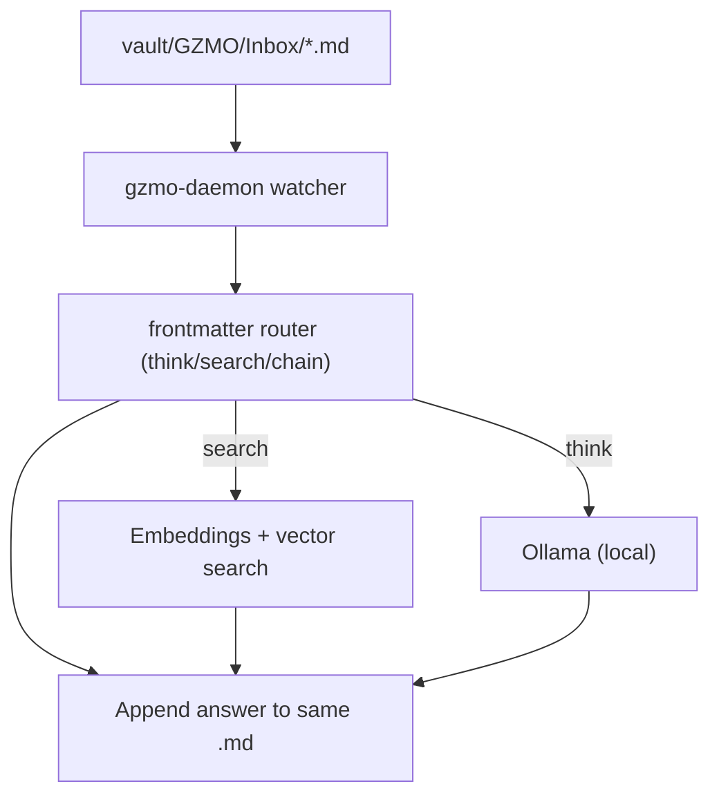

<a name="top"></a>

<h1 align="center">📁 tinyFolder</h1>

<p align="center">
  <strong>A local-first, filesystem-driven AI daemon for Markdown/Obsidian vaults (Bun + Ollama).</strong>
</p>

<p align="center">
  <a href="https://github.com/maximilianwruhs-cyber/tinyFolder/actions/workflows/ci.yml"></a>
  <a href="./LICENSE"></a>
  <a href="https://img.shields.io/badge/runtime-Bun-000000?style=flat-square&logo=bun"></a>
  <a href="https://img.shields.io/badge/LLM-Ollama-000000?style=flat-square"></a>
  <a href="https://img.shields.io/badge/storage-Markdown%20files-0969DA?style=flat-square"></a>
</p>

---

## 👻 Overview

`tinyFolder` looks like “just a folder”, but it contains **GZMO**: a daemon that watches a vault inbox, runs local inference, and writes results back into the same Markdown files.

You don’t use a chat UI. You **drop Markdown tasks into an inbox folder** and the daemon reads them, routes them by YAML frontmatter (`action: think | search | chain`), writes answers back into the same files, and continues running in the background.

What makes it “smart” (and not just “chat”):
- **Evidence-first**: `action: search` compiles an **Evidence Packet** (local facts + retrieval snippets) and answers must cite `[E#]`.
- **Fail-closed**: when evidence is weak, GZMO says **insufficient evidence** instead of guessing.
- **Small-model scaffolding**: extraction templates + multi-pass verification to keep smaller local models reliable.
- **Overnight self-improvement**: self-ask/wiki loops strengthen vault connections, with quality reports.

If you want screenshots/GIFs in the README, add them to `assets/` and link them here.

### ✨ Highlights

- **Local-first**: everything is files on disk (no cloud DB required).
- **Vault RAG**: indexes your vault into embeddings for grounded answers.
- **Autonomy loops**: pulse/chaos + dreams + self-ask + wiki consolidation.
- **Obsidian-friendly**: works naturally with a vault layout.

---

## 🧭 Table of contents

- [Quick start](#quick-start)
- [How to use (drop a task file)](#how-to-use-drop-a-task-file)
- [Proof and smoke tests](#proof-and-smoke-tests)
- [Overnight mode (idle connection strengthening)](#overnight-mode-idle-connection-strengthening)
- [Configuration](#configuration)
- [Outputs & reports (what GZMO writes)](#outputs--reports-what-gzmo-writes)
- [Troubleshooting](#troubleshooting)
- [Architecture (at a glance)](#architecture-at-a-glance)
- [Repo layout](#repo-layout)
- [Contributing](#contributing)
- [License](#license)

---

## 🚀 Quick start

### ✅ Prerequisites

- **Bun** installed (TypeScript runtime)
- **Ollama** installed and running locally

### ⚡ Install + run

```bash
# 1) Install dependencies
cd gzmo-daemon
bun install

# 2) Configure (optional)
cp ../.env.example .env

# 3) Start Ollama (in a separate terminal)
OLLAMA_KV_CACHE_TYPE=q8_0 OLLAMA_FLASH_ATTENTION=1 OLLAMA_KEEP_ALIVE=-1 ollama serve

# 4) Pull models (recommended defaults)
ollama pull hermes3:8b
ollama pull nomic-embed-text

# 5) Start the daemon
bun run summon
```

### 🛟 Safe mode (profiles)

If you want to debug/tune on weak hardware, you can run with a safe-mode profile:

```bash
cd gzmo-daemon

# Only chaos + Live_Stream (no watcher, no embeddings, no LLM)
GZMO_PROFILE=heartbeat bun run summon

# Inbox watcher + task processing (no embeddings, no autonomy loops)
GZMO_PROFILE=minimal bun run summon

# Tasks + embeddings (no dreams/self-ask/wiki/ingest)
GZMO_PROFILE=standard bun run summon
```

[Back to top](#top)

---

## 📨 How to use (drop a task file)

Tasks are Markdown files with YAML frontmatter. The daemon watches:

- `vault/GZMO/Inbox/`

Create a file like `vault/GZMO/Inbox/my-task.md`:

```yaml
---
status: pending
action: think
---
Explain the Lorenz attractor in one paragraph.
```

Save the file. The daemon will claim it, run, and append output.

### 🧩 Task actions (frontmatter routing)

Control the daemon by dropping markdown files with these YAML headers into the Inbox:

#### `action: think`

```yaml
---
status: pending
action: think
---
Explain the Lorenz attractor.
```

#### `action: search`

```yaml
---
status: pending
action: search
---
Based on your logs, why did your tension drop yesterday?
```

For `action: search`, GZMO will:
- gather deterministic local facts (ops outputs)
- retrieve relevant vault snippets
- compile an Evidence Packet
- answer **with citations** like `[E2]` or say **insufficient evidence**

#### `action: chain`

```yaml
---
status: pending
action: chain
chain_next: summarize_step2.md
---
List exactly 3 components of the chaos engine.
```

[Back to top](#top)

---

## ✅ Proof and smoke tests

From `gzmo-daemon/`:

```bash
# Typecheck + unit tests
bun run smoke

# Smoke + live proof against your local vault + Ollama
bun run smoke:full

# Deterministic multi-scenario retrieval quality gate (exits non-zero on fail)
bun run eval:quality
```

[Back to top](#top)

---

## 🌙 Overnight mode (idle connection strengthening)

If you want the system to keep strengthening connections until a real Inbox task lands:

```bash
GZMO_IDLE_CONNECT_MODE=on bun run summon
```

This runs bounded Self-Ask cycles while the Inbox has no `status: pending` tasks, with cooldown + backoff to avoid spam.

[Back to top](#top)

---

## ⚙️ Configuration

GZMO reads environment variables (via `./.env` if you use one):

- **`VAULT_PATH`**: absolute path to your vault. If not set, defaults to this repo’s `./vault`.
- **`OLLAMA_URL`**: Ollama base URL (default `http://localhost:11434`).
- **`OLLAMA_MODEL`**: inference model tag (default `hermes3:8b`).
- **`GZMO_PROFILE`**: safe-mode profile (`heartbeat | minimal | standard | full`). Defaults to `full`.

Retrieval quality stack (defaults are set by the daemon; override if needed):

- **`GZMO_MULTIQUERY`**: `on/off` — generate 3 query rewrites to improve recall.
- **`GZMO_RERANK_LLM`**: `on/off` — rerank retrieved snippets with Ollama (budgeted).
- **`GZMO_ANCHOR_PRIOR`**: `on/off` — boost chunks containing high-frequency anchors.
- **`GZMO_MIN_RETRIEVAL_SCORE`**: float — fail-closed threshold for retrieval.

Smartness/finesse gates:

- **`GZMO_EVIDENCE_PACKET`**: `on/off` — include Evidence Packet for `action: search`.
- **`GZMO_ENABLE_SELF_EVAL`**: `on/off` — verifier rewrite pass.
- **`GZMO_VERIFY_SAFETY`**: `on/off` — blocks invented paths/side-effects.

Overnight loops:

- **`GZMO_IDLE_CONNECT_MODE`**: `on/off` — run Self-Ask while Inbox is idle.

Optional overrides (all `0/1`, `false/true` supported):

- **`GZMO_ENABLE_INBOX_WATCHER`**
- **`GZMO_ENABLE_TASK_PROCESSING`**
- **`GZMO_ENABLE_EMBEDDINGS_SYNC`**
- **`GZMO_ENABLE_EMBEDDINGS_LIVE`**
- **`GZMO_ENABLE_DREAMS`**
- **`GZMO_ENABLE_SELF_ASK`**
- **`GZMO_ENABLE_WIKI`**
- **`GZMO_ENABLE_INGEST`**
- **`GZMO_ENABLE_WIKI_LINT`**
- **`GZMO_ENABLE_PRUNING`**
- **`GZMO_ENABLE_DASHBOARD_PULSE`**

[Back to top](#top)

---

## 🧾 Outputs & reports (what GZMO writes)

In your vault under `vault/GZMO/` you’ll see operational artifacts. High-signal ones:

- **`health.md`**: status snapshot (counts, profile, etc.)
- **`TELEMETRY.json`**: structured telemetry for inference/runtime
- **`self-ask-quality.md`**: Self-Ask output quality report (periodic)
- **`anchor-index.json`** / **`anchor-report.md`**: anchor density reports (periodic)
- **`rag-quality.md`** / **`retrieval-metrics.json`**: deterministic retrieval quality gate results (periodic)

[Back to top](#top)

---

## 🧯 Troubleshooting

### Sanity check your setup

Run the built-in doctor:

```bash
cd gzmo-daemon
bun run doctor
```

If you want the doctor to run write-enabled pipeline checks (it will create temporary inbox tasks), run:

```bash
cd gzmo-daemon
bun run doctor --write --profile deep
```

### Ollama unreachable

The daemon will keep running its heartbeat/logging even if Ollama is down, but inference + embeddings will be disabled until Ollama is reachable.

[Back to top](#top)

---

## 🗂️ Repo layout

- `gzmo-daemon/`: the Bun/TypeScript daemon (entrypoint: `gzmo-daemon/index.ts`)
- `vault/`: example/default vault layout (includes `vault/GZMO/Inbox/`)
- `assets/`: optional screenshots/GIFs for GitHub
- `docs/`: deeper documentation (optional)
- `install_service.sh`: installs a portable systemd user service (Linux)

[Back to top](#top)

---

## 🖥️ Auto-start (systemd, Linux)

This installs a **user** service (no sudo) and writes a machine-local unit file so there are no hardcoded “bullshit paths” in the repo.

```bash
./install_service.sh
systemctl --user daemon-reload
systemctl --user enable --now gzmo-daemon
```

Follow logs:

```bash
journalctl --user -u gzmo-daemon -f
```

[Back to top](#top)

---

## 🧠 Architecture (at a glance)



[Back to top](#top)

---

## 🤝 Contributing

See `CONTRIBUTING.md`.

## 📄 License

MIT — see `LICENSE`.

