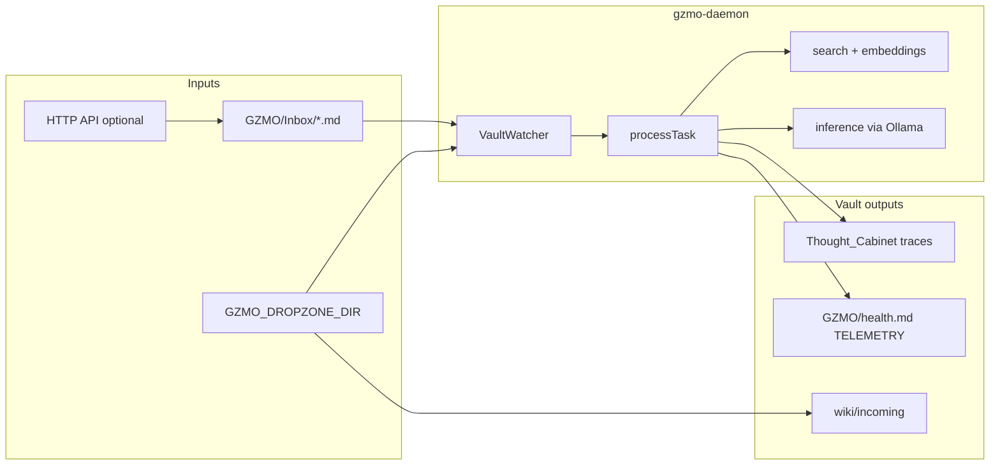

# GZMO daemon — architecture

This document is a **static map** of the tinyFolder / GZMO codebase. Operator setup and env vars remain in [README.md](../README.md); agent playbooks in [AGENTS.md](../AGENTS.md).

## System overview



**Contract:** Markdown tasks under `$VAULT_PATH/GZMO/Inbox/` with YAML frontmatter (`status`, `action`, …). The filesystem is the source of truth; the optional HTTP API only mirrors files into the same inbox.

## Entry points

| Path | Role |
|------|------|
| [gzmo-daemon/index.ts](../gzmo-daemon/index.ts) | Daemon boot: profiles, watcher, embeddings queue, optional API |
| [gzmo-daemon/doctor.ts](../gzmo-daemon/doctor.ts) | Readiness / self-heal CLI |
| [install_service.sh](../install_service.sh) | systemd user unit generation |
| [.pi/extensions/gzmo-tinyfolder.ts](../.pi/extensions/gzmo-tinyfolder.ts) | Pi agent tools (`gzmo_submit_task`, …) |
| [contrib/pi-gzmo-skill/](../contrib/pi-gzmo-skill/) | Shell inbox helpers |

## Core modules (`gzmo-daemon/src/`)

| Module | Responsibility |
|--------|----------------|
| [watcher.ts](../gzmo-daemon/src/watcher.ts) | Chokidar inbox watch; debounce; emit `task` for `pending` |
| [engine.ts](../gzmo-daemon/src/engine.ts) | `processTask`: lifecycle, pipelines, LLM, telemetry |
| [frontmatter.ts](../gzmo-daemon/src/frontmatter.ts) | `TaskDocument` load/save; status transitions |
| [vault_fs.ts](../gzmo-daemon/src/vault_fs.ts) | Path containment, atomic writes, symlink guards |
| [api_server.ts](../gzmo-daemon/src/api_server.ts) | Bun.serve REST + SSE; inbox mirror |
| [search.ts](../gzmo-daemon/src/search.ts) | Hybrid vault retrieval |
| [embeddings.ts](../gzmo-daemon/src/embeddings.ts) | Embedding store + Ollama embed API |
| [inference.ts](../gzmo-daemon/src/inference.ts) | Ollama chat via AI SDK |
| [config.ts](../gzmo-daemon/src/config.ts) | Fail-fast `VAULT_PATH` and profile validation |
| [boot_recovery.ts](../gzmo-daemon/src/boot_recovery.ts) | Stale `processing` → `pending` on restart |
| [dropzone_watcher.ts](../gzmo-daemon/src/dropzone_watcher.ts) | Desktop drop → `wiki/incoming` + auto tasks |

### Pipelines

| Path | Actions |
|------|---------|
| [pipelines/think_pipeline.ts](../gzmo-daemon/src/pipelines/think_pipeline.ts) | `think`, `chain` |
| [pipelines/search_pipeline.ts](../gzmo-daemon/src/pipelines/search_pipeline.ts) | `search` (RAG, `[E#]` evidence) |

### Subsystems (feature-flagged)

- **belief/**, **knowledge_graph/** — entity/collision gates
- **learning/** — strategy ledger, trust
- **reasoning/** — dialectic, tree-of-thought search
- **doctor/** — host readiness and vault healers
- **tools/** — `vault_read`, `fs_grep`, `dir_list` (vault-bounded)

## Task lifecycle

```
pending → processing → completed | failed | unbound
```

1. File lands in `GZMO/Inbox/` (user, dropzone side-effect, or HTTP API).
2. `VaultWatcher` debounces and emits `task` when `status: pending`.
3. `processTask` locks the file, runs `ThinkPipeline` or `SearchPipeline`, calls Ollama, writes response sections, sets `completed` (or `unbound` on clarification halt).
4. Optional: `chain_next` spawns a follow-up inbox file.

## Trust boundaries

| Boundary | Notes |
|----------|--------|
| **Vault root** | All writes via `vault_fs`; tools reject `..` and symlinks |
| **Dropzone** | May live outside vault; treat as untrusted input (parsers, ZIP) |
| **HTTP API** | Off by default; requires `GZMO_API_TOKEN`; bind `127.0.0.1` + `GZMO_LOCAL_ONLY=1` |
| **Ollama** | Default `localhost:11434`; do not point at untrusted remote instances |

## Tests and CI

- **Unit tests:** `gzmo-daemon/src/__tests__/` — `bun test` via `bun run smoke`
- **E2E:** `proof_local_vault.ts`, doctor `--write` (need Ollama + vault)
- **CI:** [.github/workflows/smoke.yml](../.github/workflows/smoke.yml)
