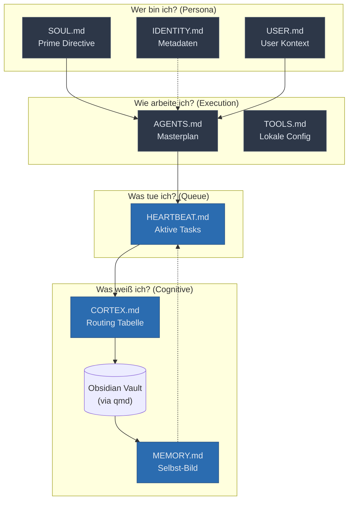
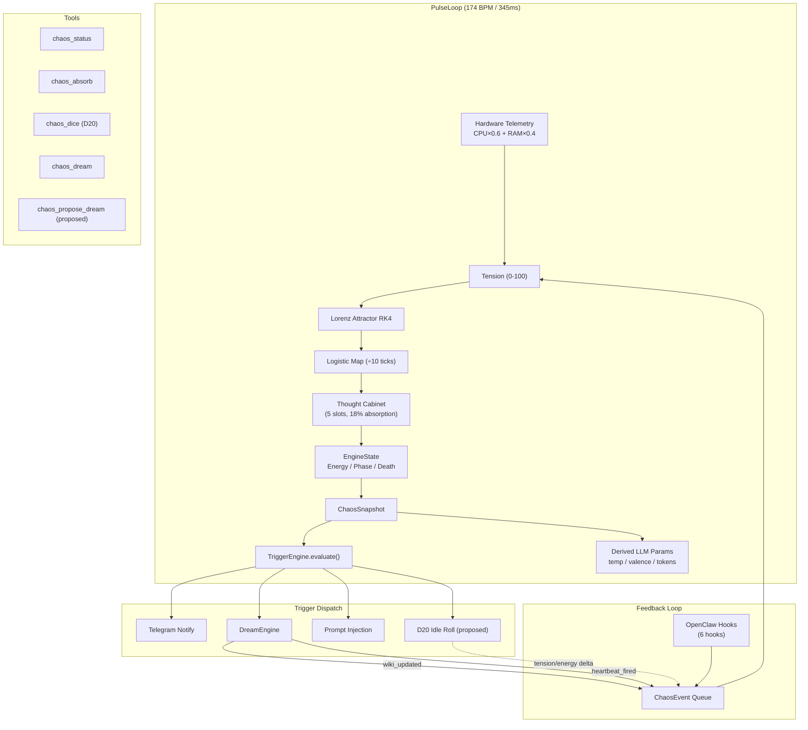

# Session Distillation — Chaos Engine

*Distilled from 4 artifacts (57 KB) across multiple development sessions.*


## Source: chaos_engine_analysis.md (session 11bc5523)

# Chaos Engine & Thought Cabinet — Vollständige Code-Analyse & Integrationsoptionen

## Inhaltsverzeichnis

- [Modulübersicht](#modulübersicht)
- [Phase-für-Phase Analyse](#phase-für-phase-analyse)
  - [1. Lorenz Attractor](#1-lorenz-attractor-chaosrs)
  - [2. Engine State Machine](#2-engine-state-machine-enginers)
  - [3. Thought Cabinet](#3-thought-cabinet-thoughtsrs)
  - [4. Feedback Channel](#4-feedback-channel-feedbackrs)
  - [5. PulseLoop](#5-pulseloop-pulsers)
  - [6. Trigger Engine](#6-trigger-engine-triggersrs)
  - [7. Stealth Discovery](#7-stealth-discovery-stealthrs)
- [Datenfluss im Gesamtsystem](#datenfluss-im-gesamtsystem)
- [Dependency Audit](#dependency-audit)
- [Portabilitäts-Matrix](#portabilitäts-matrix)
- [Integrationsarchitekturen](#integrationsarchitekturen)
  - [Option A: Rust Sidecar Binary](#option-a-rust-sidecar-binary-mit-http-api)
  - [Option B: MCP Server (Rust/WASM)](#option-b-mcp-server-rustwasm)
  - [Option C: Python Re-Implementation](#option-c-python-re-implementation-als-mcp-server)
  - [Option D: OpenClaw Plugin](#option-d-openclaw-plugin-direkte-injection)
- [Bewertungsmatrix](#bewertungsmatrix)
- [Verdict & Empfehlung](#verdict--empfehlung)

---

## Modulübersicht

Das `gzmo-chaos` Crate besteht aus **7 Modulen** mit insgesamt **~4.500 Lines of Code**:

```
gzmo-chaos/src/
├── lib.rs        (40 LOC)   — Public API, re-exports
├── chaos.rs      (222 LOC)  — Lorenz Attractor + Logistic Map
├── engine.rs     (117 LOC)  — Energy/Phase/Death state machine
├── thoughts.rs   (277 LOC)  — Thought Cabinet (Disco Elysium)
├── feedback.rs   (188 LOC)  — Bidirectional skill ↔ chaos channel
├── pulse.rs      (581 LOC)  — Unified 174 BPM heartbeat (the brain)
└── triggers.rs   (467 LOC)  — Autonomous threshold-based trigger system
```

Plus ein externes Modul in `gzmo-core`:
```
gzmo-core/src/stealth.rs (55 LOC)  — Passive hardware fingerprinting
```

---

## Phase-für-Phase Analyse

### 1. Lorenz Attractor ([chaos.rs](file:///home/maximilian-wruhs/Dokumente/Playground/GZMO/gzmo_latest/GZMO_v0.0.1/gzmo-chaos/src/chaos.rs))

**Was es tut:** Implementiert das klassische Lorenz-System (σ=10, ρ=28, β=8/3) als 3D-Attraktor mit **RK4-Integration** (4th-order Runge-Kutta, dt=0.005).

**Kernstrukturen:**
- `LorenzAttractor` — 3D-State (x, y, z) + Kontrollparameter (σ, ρ, β)
- `LogisticMap` — Sekundäre Chaos-Quelle (r=3.99), periodisch reseedet vom Lorenz
- `Phase` — Enum `{Idle, Build, Drop}`, abgeleitet von Hardware-Spannung

**Kritische Methoden:**
| Methode | Was sie tut | Portabilitätsrisiko |
|---------|-------------|---------------------|
| `step()` | RK4-Integration (12 Operationen pro Tick) | ⬜ Null — pure Mathematik |
| `update_phase()` | σ-Parameter verschoben je Phase (8/10/14) | ⬜ Null |
| `normalized_output()` | x ∈ [-20, 20] → [0, 1] | ⬜ Null |
| `apply_rho_mutation()` | Permanente ρ-Verschiebung durch Thought Cabinet | ⬜ Null |
| `apply_cognitive_noise()` | Transiente σ-Perturbation durch inkubierende Thoughts | ⬜ Null |

**Tests:** 4 Tests (Boundedness, Logistic unit interval, Normalized output, Phase mapping). Alle deterministisch.

> **Portabilität: 🟢 TRIVIAL** — Zero Abhängigkeiten, pure `f64` Arithmetik. 1:1 portierbar in jede Sprache.

---

### 2. Engine State Machine ([engine.rs](file:///home/maximilian-wruhs/Dokumente/Playground/GZMO/gzmo_latest/GZMO_v0.0.1/gzmo-chaos/src/engine.rs))

**Was es tut:** Verwaltet den Lebenszykus: Energie (0-100), Phasen (Idle/Build/Drop), Tod und Wiedergeburt.

**Kernmechaniken:**
- **Energy Drain**: `gravity × friction × 0.02 × phase_multiplier × thought_drain_mod`
  - Idle: Regen > Drain (Erholung)
  - Build: Regen × 0.3 - Drain (netto negativ)
  - Drop: Nur Drain, keine Regeneration ("pure hemorrhage")
- **Regen**: `2.5 × (1 - energy/100)` — inverse Kurve, stärker bei Erschöpfung
- **Tod**: Wenn `energy ≤ 0` → `alive = false`, `deaths += 1`
- **Wiedergeburt**: 30% Chance per Tick (`chaos_roll > 0.7`) → Energy auf 30
- **Inbox Drop**: +20 Energy, kann Wied

*[...truncated for embedding efficiency]*


## Source: gzmo_cognitive_architecture.md (session 57af45bf)

# GZMO Cognitive Architecture

This document provides a clear overview of the `core_identity` markdown files within the `edge-node` project. Instead of hardcoding behavior in source code, GZMO's cognitive architecture is entirely driven by plain-text files that act as an operating system.

## The Cognitive Loop



> [!NOTE]
> Static files (grey) format the boundaries and rules of the agent. Dynamic files (blue) are updated during operation to reflect current state and self-evolution.

---

## 1. Das "Wer bin ich?" (Die Kern-Identität)

These files are the foundational laws. They are **static** and must never be altered autonomously by the agent.

- **`SOUL.md`**: The Prime Directive. Defines character (Witty, Loyal, Systemadmin) and unbending rules (No external data exfiltration, the "Sudo" confirmation rule).
- **`USER.md`**: Profile about the human (Maximilian). Sets the context of *who* the agent serves and what values matter (Sovereignty, local inference).
- **`IDENTITY.md`**: Lightweight static metadata (Chosen Emoji, Avatar path).

## 2. Das "Wie arbeite ich?" (Das Betriebshandbuch)

These files function as the Runbooks.

- **`AGENTS.md`**: The Masterplan. Defines the startup sequence (Read SOUL, USER, MEMORY), sets strict rules on when to reply in group chats, and dictates how to use proactive "Heartbeats".
- **`TOOLS.md`**: The environment cheat sheet. Used for local override configurations (e.g., local home server IPs, camera aliases) to keep shared AI skills separated from private infrastructure details.

## 3. Das "Was tue ich gerade?" (Die Arbeitswarteschlange)

- **`HEARTBEAT.md`**: The dynamic To-Do board. When GZMO wakes up for an autonomous background heartbeat, it checks this file. Currently, the highest priority task is initiating the "Dream Cycle" (self-reflection).

## 4. Das "Was weiß ich?" (Das Gedächtnis)

This is where the magic happens. These files form the dynamic output of the cognitive loops.

- **`CORTEX.md`**: The Routing Table. Maps high-level identity concepts to specific `qmd://` URIs in the Obsidian Vault. Tells the agent exactly *where* to look to expand its context on a given topic, keeping the RAM footprint small.
- **`MEMORY.md`**: GZMO's "Ich-Bewusstsein" (Self-Image). A continuously updated summary. Distilled from daily logs, it holds the agent's current tech stack reality, open "Dreams" (evolution proposals), and significant lessons learned.

---

### The Heartbeat Lifecycle

1. **Wake Up**: The agent boots up and reads `SOUL`, `USER`, and `AGENTS` to establish identity rules.
2. **Determine Action**: It reads `HEARTBEAT` to see what is currently pending.
3. **Fetch Context**: Using `CORTEX`, it queries the specific `Obsidian_Vault` pages needed to perform the required action.
4. **Reflect & Rest**: At the end of the operation, it updates `MEMORY.md` with new insights and creates proposed "Dreams" for future capabilities before going back to sleep.


## Source: phase_b_research_prompts.md (session 71b59441)

# Phase B — Autonomous Research Design Document

> Synthesized from NotebookLM sources (Librarian, Token-Efficient, Systemhygiene, GZMO_soul), the existing chaos-engine codebase, and the Obsidian Vault structure.

---

## 1. Architecture Decision: OpenClaw Skill (Option B)

After reviewing the three options against the NotebookLM sources, **a separate OpenClaw skill** is the right architecture. Here's why — mapped to GZMO's specific constraints:

| Criterion | Plugin Extension (A) | **OpenClaw Skill (B)** ✅ | Background Daemon (C) |
|-----------|---------------------|---------------------------|----------------------|
| Crash isolation | ❌ Takes down PulseLoop | ✅ Skill failure ≠ engine failure | ✅ Fully decoupled |
| Chaos state access | ✅ Direct `pulse.snapshot()` | ⚠️ Via `chaos_status` tool call | ❌ Reads stale JSON file |
| Token accounting | ❌ Mixed with engine tokens | ✅ Isolated budget tracking | ✅ Separate process |
| Feedback latency | ✅ Instant `emitEvent()` | ⚠️ Via `chaos_propose_dream` tool | ❌ File-based, eventual |
| Implementation cost | Low (just add methods) | Medium (new skill scaffold) | High (new process + IPC) |

**The key insight from the Token-Efficient source**: The "multiplier effect" means research tokens compound inside the engine's context window if done as a plugin extension. A separate skill gets its own context window — natural isolation.

**How chaos state access works**: The skill calls `chaos_status` (already registered) to read tension/energy/phase, then calls `chaos_propose_dream` (just added) to feed results back. The tools ARE the interface — no cross-plugin communication needed.

### Skill Structure
```
extensions/chaos-research/
├── SKILL.md          # OpenClaw skill manifest
├── src/
│   ├── index.ts      # Skill registration
│   ├── arxiv.ts      # arXiv API client
│   ├── librarian.ts  # Adapted Librarian Pattern
│   └── budget.ts     # Token budget state machine
└── package.json
```

---

## 2. Trigger Design: When Does GZMO Research?

Mapped to actual chaos engine signals (from `feedback.ts` and `triggers.ts`):

### Research Trigger Matrix

| Research Type | Trigger Condition | Cooldown | Token Budget | Stopping Condition |
|--------------|-------------------|----------|-------------|-------------------|
| **Wiki deep-dive** | HEARTBEAT cycle (step 4-5) | Per-cycle (every HEARTBEAT) | 2000 tokens | Max 3 QMD queries |
| **Web search** | D20 roll ≥ 16 during idle AND crystallized dream mentions unknown concept | 30 min | 3000 tokens | Max 2 search queries |
| **arXiv scan** | Weekly scheduled (via `autonomous_pulse` tick counter: `tick % 302400 === 0` ≈ 7 days) | 7 days | 5000 tokens | Max 10 abstracts |
| **NotebookLM query** | After crystallization event where thought category = "dream" | 60 min | 1500 tokens | 1 query |

### Why This Matrix Works

1. **Wiki deep-dive** is already free — QMD runs locally via Ollama, zero API cost. This should be the default, highest-frequency action. Already exists as `qmd query`.

2. **Web search** is gated behind **two conditions**: a high D20 roll (≥16, probability 25%) AND a crystallized dream containing an unknown concept. This prevents random googling. The dream distillation gives direction; the D20 gives permission.

3. **arXiv scan** is a **batch operation** — run once a week, fetch 10 abstracts, write a digest. Low frequency but high value. The tick counter at 174 BPM gives us: 174 × 60 × 24 × 7 = 1,753,920 ticks/week. Since `autonomous_pulse` fires at 520 ticks, we check `pulseCount % 2016 === 0` (2016 autonomous pulses per week).

4. **NotebookLM query** is the cheapest external call — it's already indexed and curated. Use it after crystallization to cross-reference new insights against existing knowledge.

### Total Token Budget

```
Weekly worst-case:
  Wiki deep-dive:    0 tokens (local Ollama)
  Web search:        3000 × (7×24/0.5 × 0.25) = ~252K tokens/week ← TOO HIGH
  arXiv scan:        5000 × 1 = 5K tokens/week
  NotebookLM:   

*[...truncated for embedding efficiency]*


## Source: chaos_engine_analysis.md (session 71b59441)

# GZMO Chaos Engine — Full Trigger & Systems Analysis

> **Last verified against live code**: 2026-04-16 09:09 CEST

## Architecture Overview



---

## 1. Registered Triggers

All triggers are **edge-triggered** (fire on threshold crossing, not while above/below). Each has a per-trigger cooldown in ticks.

| # | Trigger Name | Type | Condition | Cooldown | Action | Status |
|---|---|---|---|---|---|---|
| 1 | `tension_critical` | `above` | tension > 85 | 90 ticks (~30s) | 📡 Telegram: "⚡ Tension critically high" | ✅ Active |
| 2 | `tension_calm` | `below` | tension < 15 | **1500 ticks (~8m)** | 📡 Telegram: "🌊 Tension critically low" | ✅ Active |
| 3 | `energy_critical` | `below` | energy < 10 | 90 ticks (~30s) | 📡 Telegram: "🔋 Energy critical" | ✅ Active |
| 4 | `phase_drop` | `phaseEnter` | phase → DROP | 30 ticks (~10s) | 📡 Telegram: "📉 Phase: DROP" | ✅ Active |
| 5 | `death_event` | `death` | deaths increased | 1 tick | 📡 Telegram: "💀 Engine died and reborn" | ✅ Active |
| 6 | `crystallization` | `crystallization` | thought crystallized | 1 tick | 📡 Telegram: "🔮 Thought crystallized" | ✅ Active |
| 7 | `autonomous_pulse` | `periodic` | every 520 ticks (~3m) | 520 ticks | 🧠 injectPrompt + 🌙 DreamEngine | ✅ Active |

### Trigger Analysis

#### `tension_critical` + `tension_calm` — The Stress Barometer
- **Source**: Hardware telemetry (CPU×0.6 + RAM×0.4) + Thought Cabinet's `tensionBias` mutation
- **Behavior**: `tension_calm` fires when tension crosses below 15. During idle, the node sits at ~10-18% tension. With the 1500-tick cooldown (~8 min), this now fires at most ~7 times/hour — acceptable for monitoring.
- **The idle problem**: Even with the raised cooldown, the attractor orbits in a very narrow loop during idle because there's no external input to perturb it. The system is technically alive but effectively frozen in a tiny region of phase space.

#### `energy_critical` — The Death Warning
- **Source**: Energy drain = `gravity × friction × 0.02 × phase_multiplier × thought_drain_mod`
- **Behavior**: With default settings (gravity=9.8, friction=0.5), drain in Idle phase = `9.8 × 0.5 × 0.02 × 0.5 = 0.049%/tick`. Regen at 10% energy = 2.25%/tick.
- **Assessment**: Energy almost never hits 10% unless multiple thoughts are incubating in DROP phase. Correctly placed as a genuine emergency.

#### `phase_drop` — The Crisis Alert
- **Source**: `phaseFromTension()` — tension ≥ 66 → DROP
- **Assessment**: Well-calibrated. Only fires on sustained high CPU/RAM usage or if `tensionBias` mutation has pushed the baseline up.

#### `death_event` — The Rebirth Cycle
- **Source**: Energy ≤ 0 → death. 30% chance per tick for rebirth (chaosRoll > 0.7).
- **Assessment**: Correct. Deaths are

*[...truncated for embedding efficiency]*
