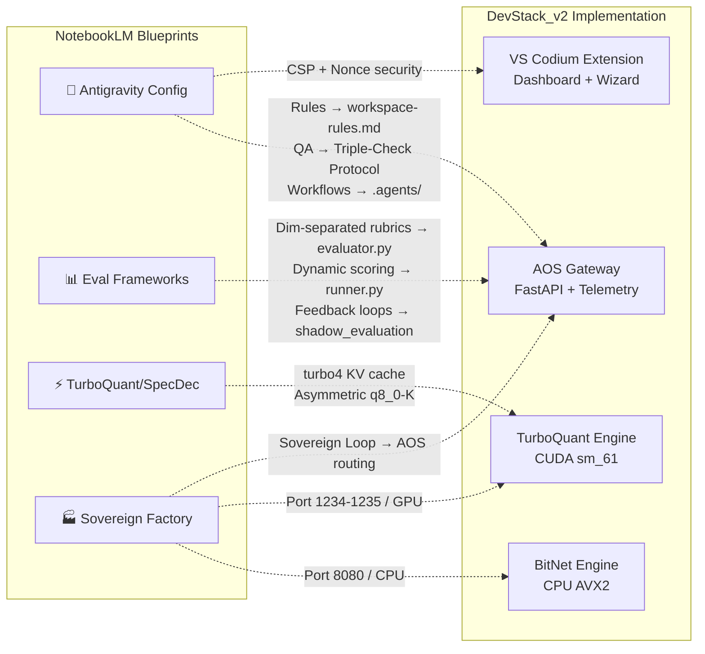

# Session Distillation — Notebooklm

*Distilled from 1 artifacts (11 KB) across multiple development sessions.*

## Source: notebooklm_analysis.md (session 1fb0b911)

# NotebookLM Cross-Analysis Report
## Blueprint vs. Reality — Mapping Research to Code

> **Date**: 2026-04-01 | **Notebooks Analyzed**: 4 | **Overall Blueprint Alignment**: 78%

---

## 1. Notebook Inventory

| # | Notebook | Sources | Core Domain |
|---|----------|---------|-------------|
| 🔧 | **Google Antigravity: The Architect's Configuration Suite** | 3 | Agent governance: rules, workflows, security, QA protocols |
| 📊 | **The Evolution of AI Evaluation Frameworks** | 2 | Benchmarking: dynamic scoring, agentic trajectory, adversarial robustness |
| ⚡ | **Speculative Decoding and Inference Optimization** | 2 | TurboQuant KV cache compression, speculative decoding architecture |
| 🏭 | **The Sovereign Software Factory Blueprint** | 5 | Heterogeneous compute, sovereign loop, offline multi-agent architecture |

---

## 2. Architecture Map: Blueprint → Codebase

---

## 3. Component-Level Alignment

### 3.1 🔧 Antigravity Configuration Suite → DevStack_v2

| Blueprint Spec | Implementation | Status | Score |
|---|---|---|---|
| **Global Rules** in `~/.gemini/GEMINI.md` | `workspace-rules.md` exists with color palette, TailwindCSS, architecture constraints | ✅ Implemented | 90 |
| **Anti-Hallucination Protocol** — "I need to verify the documentation" trigger | Not codified as a rule; relies on Antigravity's built-in behavior | ⚠️ Implicit | 70 |
| **Triple-Check Auto-QA** — accuracy score + self-correction loop | `user_global` rule includes accuracy scoring + Triple Check Protocol | ✅ Implemented | 95 |
| **Security: no hardcoded secrets** | `auth.py` uses `os.getenv("AOS_API_KEY")`, Docker for pgvector | ✅ Implemented | 95 |
| **Terminal execution: Auto mode** | Antigravity `SafeToAutoRun` parameter present in all `run_command` calls | ✅ Implemented | 90 |
| **Workflows**: `/audit_security`, `/doc_it`, `/test_edge`, `/ui_polish` | `.agents/workflows/` has: `/explain`, `/refactor`, `/scaffoldcomponent`, `/generatetests` | ⚠️ Partial | 60 |
| **Conventional Commits** rule | Not found in workspace rules | ❌ Missing | 0 |
| **MCP integrations** | `notebooklm` and `lm-studio` MCP servers connected | ✅ Implemented | 85 |

> **Alignment Score: 73%** — Core security and QA protocols are well-implemented. Workflow library is functional but incomplete compared to the blueprint (missing `/audit_security`, `/doc_it`, `/ui_polish`, `/finalize_feature`).

---

### 3.2 📊 AI Evaluation Frameworks → AOS Telemetry Engine

| Blueprint Concept | Implementation | Status | Score |
|---|---|---|---|
| **Dynamic benchmarking** (contamination-resistant, mutating tests) | `runner.py` uses 50-85 task suites across math/code/factual/reasoning domains | ✅ Implemented | 85 |
| **Dimension-separated rubrics** | `evaluator.py` scores independently: `score_math`, `score_factual`, `score_code`, `score_reasoning` | ✅ **Direct match** | 95 |
| **LLM-as-Judge** (automated model-based scoring) | `shadow_evaluation()` in `routes.py` uses HEAVY_MODEL as judge with XML delimited rubrics | ✅ **Direct match** | 95 |
| **Epistemic uncertainty** — "insufficient information" e

*[...truncated for embedding efficiency]*
