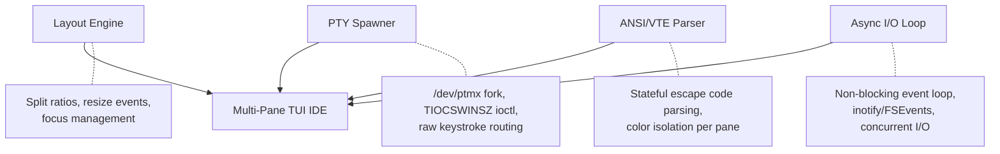

# Session Distillation — Tui

*Distilled from 2 artifacts (15 KB) across multiple development sessions.*


## Source: tui_ide_layout_research.md (session e4d0a689)

# Modern TUI IDE Layouts for AI Workflows

The paradigm of "Terminal-as-an-IDE" is shifting rapidly in 2025/2026. With the introduction of powerful CLI-based AI agents (like Claude Code, Antigravity, OpenClaw, Aider), the traditional "editor + file tree" layout is evolving into something much more dynamic.

Here is a breakdown of the latest best practices and community consensus for TUI (Zellij/tmux) layout architectures.

---

## 1. The Death of the Permanent File Tree 
In traditional IDEs (VS Code, JetBrains), the left-hand sidebar is dominated by a file explorer. In modern TUI workflows, this is considered **wasted real estate**.

> [!TIP]
> **Use popups or fuzzy-finders instead of a permanent file column.**

AI agents navigate codebases for you, and when *you* need a file, a fuzzy finder (like `fzf`, `telescope.nvim`, or `yazi` mapped to a floating popup) is 10x faster than manually clicking down a tree. Keeping `yazi` permanently pinned to 20% of your screen is an anti-pattern for AI workflows.

---

## 2. The Dominant Layout Patterns

Based on research across modern developer setups, there are three primary layout topologies optimized for AI-assisted workflows:

### Pattern A: The "Driver / Navigator" (Recommended)
This pattern maximizes the space given to the two most important entities: You (the driver) editing code, and the AI (the navigator) thinking/running tests.

```text
┌──────────────────────────────────────┐
│                                      │
│           Main Editor                │
│       (Neovim / Helix / Nano)        │
│                70%                   │
│                                      │
├───────────────────┬──────────────────┤
│    Aux Shell      │   Agent Logs /   │
│ (Manual commands) │    AI Output     │
│       30%         │       70%        │
└───────────────────┴──────────────────┘
```
**Why it works:** Your eyes track top-to-bottom. Code in the big top pane; AI observability and manual shell operations in the bottom row.

### Pattern B: The "Side-by-Side Agent"
Ideal for ultrawide monitors. Treats the AI like a pair-programming partner sitting next to you.

```text
┌───────────────────────┬──────────────┐
│                       │              │
│                       │  AI Agent /  │
│      Main Editor      │ Visualizer   │
│          65%          │      35%     │
│                       │              │
│                       ├──────────────┤
│                       │  Aux Shell   │
│                       │    Fixed     │
└───────────────────────┴──────────────┘
```

### Pattern C: The "Floating Workspace" (Zellij Centric)
Zellij has excellent first-class support for **floating panes**. In this setup, your base layer is literally just ONE massive editor pane (100%).

> [!NOTE]
> **How Floating Workflows operate:**
> - Base layer: 100% Neovim/Editor
> - `Ctrl + P`: Pops up Yazi (floating center) to pick a file, closes on selection.
> - `Ctrl + T`: Pops up a terminal to run a quick test.
> - `Ctrl + A`: Toggles the AI Agent visualizer floating pane.

---

## 3. Best Practices for TUI Frameworks

1. **Clean Screen Space:** Maximize your terminal real estate. Don't crowd the screen with system monitors (`htop`/`btop`) unless diagnosing a specific issue.
2. **Distinct Visual Languages:** Ensure your *code* looks distinctly different from your *logs*. Using our Catppuccin Mocha theme everywhere achieves this, combined with color-coded log levels in the Agent visualizer.
3. **Decoupled Tooling:** Keep the main shell focused. Instead of opening `yazi` manually inside a shell, wire Zellij to open it as a distinct toolpane that can be dismissed.
4. **Agent Observability is Key:** As AI takes over more autonomy, having a dedicated area (like our Rust visualizer) to strictly monitor *what* the AI is doing, without mixing it with manual bash output, is essential.

## 4. Applying this to our TUI Framework

If we drop the persistent Yazi pane, we can rethink `ide.kdl`.

### Proposal: "The Co

*[...truncated for embedding efficiency]*


## Source: tui_framework_deep_dive.md (session fede801f)

# TUI Framework — Deep Dive Analysis

> Complete architecture review based on NotebookLM sources (9 documents)

---

## 1. The Problem You're Solving

The modern developer workspace is broken. Electron-based IDEs consume gigabytes of RAM, context-switching between five different windows shatters flow state, and UI latency during heavy compilation is a constant friction. The TUI Framework project reclaims developer focus by replacing that stack with a **memory-safe, zero-latency, terminal-native workspace** consisting of three core panes:

| Pane | Purpose | CLI Equivalent |
|------|---------|----------------|
| **Directory Tree** | File navigation and project structure | `yazi`, `broot` |
| **Main Terminal** | Primary interactive shell | `bash`, `zsh` |
| **Task Monitor** | System metrics, build logs, process overview | `btop`, `htop` |

This isn't just "another terminal multiplexer." It's an **IDE paradigm built entirely within the terminal**, where every interaction happens at the speed of the kernel, not a JavaScript runtime.

---

## 2. The Hard Technical Truth

> [!IMPORTANT]
> Drawing boxes in the terminal is trivial. The real challenge is **tricking the OS into treating a sub-pane as a physical I/O device** without breaking stdout or bleeding colors across the grid.

Your sources nail the exact bottleneck that kills most custom terminal projects. Building a multi-pane TUI that hosts *interactive shells* (not just static text) requires solving four deeply intertwined OS-level problems:

### The Four Architectural Pillars



| Pillar | What It Does | Why It's Hard |
|--------|-------------|---------------|
| **Layout Engine** | Divides the terminal screen into resizable panes | Must translate pixel-like coordinates to character cells and handle terminal resize signals (`SIGWINCH`) |
| **PTY Spawner** | Creates isolated pseudoterminals via `/dev/ptmx` for each sub-shell | Each child process believes it owns a real terminal; the host must fake window dimensions via `ioctl(fd, TIOCSWINSZ, &ws)` |
| **ANSI/VTE Parser** | Intercepts and renders escape sequences without cross-pane contamination | A single mishandled `\e[38;2;r;g;bm` sequence bleeds color into adjacent panes — requires a full state machine |
| **Async I/O Loop** | Routes keystrokes in, renders output out, watches filesystem — all without blocking | Must multiplex reads from N file descriptors + filesystem watchers + user input simultaneously |

> [!NOTE]
> Your sources explicitly confirm all of these via Linux kernel documentation (`man pty`, `man ptmx`, `man tty_ioctl`). **Zero technical falsehoods detected** across all 9 documents.

---

## 3. The Three Execution Paths

Your research lays out three fundamentally different approaches. Here's my honest assessment of each:

---

### Path A: The Zero-Code MVP (Zellij) 🏆

**Concept:** Don't build the multiplexer — use an existing one. [Zellij](https://zellij.dev/) is a Rust-based terminal multiplexer that already handles PTY spawning, ANSI parsing, input routing, and window resizing. We simply author a `.kdl` layout file.

```kdl
// ide.kdl — The entire "framework" in 14 lines
layout {
    pane split_direction="vertical" {
        pane size="20%" command="broot"
        
        pane split_direction="horizontal" size="80%" {
            pane size="70%" focus=true
            pane size="30%" command="btop"
        }
    }
}
```

**Launch:** `zellij --layout ide`

#### Strengths
- **Instant deployment** — functional IDE workspace in seconds, not months
- **Battle-

*[...truncated for embedding efficiency]*
