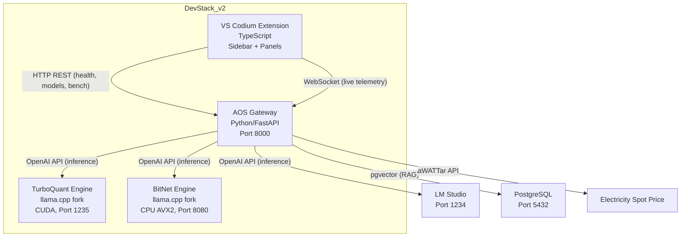

# Session Distillation — Verification

*Distilled from 5 artifacts (42 KB) across multiple development sessions.*


## Source: verification_report.md (session 08101175)

# AOS DevStack v2 — Full Verification Report

> **Date**: 2026-04-03 | **Scope**: Every Python module, shell script, pipeline, systemd unit, and test in the project.

---

## Executive Summary

| Category | Total | ✅ Pass | ❌ Fail | ⚠️ Warning |
|---|---|---|---|---|
| **Shell Scripts (syntax)** | 8 | 8 | 0 | 2 |
| **Python Module Imports** | 30 | 28 | 2 | 0 |
| **Test Suite** | 52 | 44 | 8 | 0 |
| **Source Code (bugs)** | ~30 files | — | 1 critical | 3 minor |
| **Pipelines** | 3 | 2 | 0 | 1 |

**Overall verdict**: The core gateway, inference router, benchmark engine, energy metering, evaluator, fitness scorer, training pipeline, and deployment stack are **functionally sound**. There are **3 real bugs** and **8 stale tests** that need fixing before this ships.

---

## 🔴 CRITICAL BUGS

### 1. `service.py:126` — Comment merged with `if` statement (BROKEN LOGIC)

```python
# Line 126 — the comment and the if-statement are ON THE SAME LINE:
# Telemetry database logging decoupled for single-gpu limits        if eval_score is not None:
```

The comment prefix `#` was eaten. The line reads:
```
        # Telemetry database logging decoupled for single-gpu limits        if eval_score is not None:
```

This means **the entire `if eval_score is not None:` block** (lines 126-135) is dead code — it's treated as a comment. The stigmergy note write and the energy-only fallback log will **never execute**.

**Fix**: Split into two lines.

[service.py:126](file:///home/maximilian-wruhs/Dokumente/Playground/DevStack_v2/AOS/src/aos/features/inference/service.py#L126)

---

### 2. Missing module: `aos.features.market.leaderboard`

The shim at `aos/telemetry/leaderboard.py` imports from `aos.features.market.leaderboard`, but that module does not exist anywhere in the codebase.

```
ModuleNotFoundError: No module named 'aos.features.market'
```

The leaderboard functionality actually lives inline in `aos/features/inference/router.py` (the `/v1/leaderboard` endpoint). The shim points to a package that was never created.

Similarly, `aos/telemetry/model_discovery.py` imports from `aos.features.benchmark.model_discovery`, and `aos/telemetry/recommender.py` imports from `aos.features.benchmark.recommender` — these files do exist in `features/benchmark/`, so they're fine.

**Impact**: Any code or test that does `from aos.telemetry.leaderboard import ...` will crash. The 2 `TestHealthCheck` tests fail because they try to `patch("aos.telemetry.market_broker.init_db")` which also doesn't exist.

[leaderboard.py](file:///home/maximilian-wruhs/Dokumente/Playground/DevStack_v2/AOS/src/aos/telemetry/leaderboard.py)

---

### 3. 8 Test Failures — Stale mocks referencing deleted functions

All 8 test failures root-cause to **two stale mock targets**:

| Tests (6) | Mock target | Status |
|---|---|---|
| `TestShadowEvaluation` (6 tests) | `aos.features.inference.service.log_inference` | **Function doesn't exist** — was removed during DDD refactor. Shadow evaluation now uses `log()` + `write_stigmergy_note()` directly. |
| `TestHealthCheck` (2 tests) | `aos.telemetry.market_broker.init_db` | **Module doesn't exist** — `market_broker` was never created. |

[test_routes.py](file:///home/maximilian-wruhs/Dokumente/Playground/DevStack_v2/AOS/tests/test_routes.py)

---

## 🟡 WARNINGS

### 4. `start-gateway.sh` — Wrong working directory

```bash
cd "$SCRIPT_DIR" || exit 1    # This CDs into scripts/boot/
```

But then:
```bash
export PYTHONPATH="src"       # Expects AOS/src, but cwd is scripts/boot/
python3 -m aos.gateway.app    # Will fail: can't find aos module
```

`$SCRIPT_DIR` resolves to `AOS/scripts/boot/`, not `AOS/`. The venv activation also looks for `.venv/bin/activate` in `scripts/boot/` where it doesn't exist.

**Fix**: Navigate to project root, not script directory.

[start-gateway.sh](file:///home/maximilian-wruhs/Dokumente/Playground/DevStack_v2/AOS/scripts/boot/start-gateway.sh)

### 5. `start_autocomplete.sh` — Hardcoded LM Studio path instead of cen

*[...truncated for embedding efficiency]*


## Source: acceptance_test_guide.md (session 08101175)

# AOS v4.2.0 — Post-Reboot Acceptance Test Guide

**Purpose:** Validate every user-facing pipeline and service after a clean reboot.  
**Personas:** 🧑‍💼 Customer (desktop user) · 🔧 Service Technician (remote operator)  
**Time required:** ~15 minutes  
**Prerequisite:** Machine has been rebooted. You are logged in to the Ubuntu desktop.

---

## Test 1: Boot Validation (🔧 Technician)

> Verify that all systemd-managed services came up automatically after reboot.

### Step 1.1 — Check service status
Open a terminal and run:
```bash
systemctl status aos-engine-main aos-engine-autocomplete aos-telegram aos-rag-watcher --no-pager
```

**✅ Expected:** All 4 services show `active (running)` with green dots.  
**❌ Fail if:** Any service shows `failed`, `inactive`, or `activating` for more than 60 seconds.

> [!TIP]
> If an engine shows `activating`, it may still be waiting for VRAM to clear. Wait 30s and re-check.

### Step 1.2 — Check Docker containers
```bash
docker ps --format "table {{.Names}}\t{{.Status}}"
```

**✅ Expected:**
| Container | Status |
|---|---|
| aos-pgvector | Up ... (healthy) |
| openshell-cluster-nemoclaw | Up ... (healthy) |

**❌ Fail if:** Either container is missing or shows `unhealthy`.

### Step 1.3 — Check GPU allocation
```bash
nvidia-smi
```

**✅ Expected:** ~6-7GB VRAM used (Qwen 9B + drafter + autocomplete model loaded).  
**❌ Fail if:** 0MB used (models didn't load) or 8192MB (OOM, saturated).

---

## Test 2: RAG Pipeline — Customer Bill Ingestion (🧑‍💼 Customer)

> Simulate a customer dropping a new invoice into the watched folder.

### Step 2.1 — Prepare a test PDF
Create a fake invoice file. Open the file manager and navigate to:
```
~/Schreibtisch/AOS_Rechnungen/
```

Create a new text file called `Rechnung_Test_2026.txt` with this content:
```
RECHNUNG Nr. 2026-TEST-001
Datum: 04.04.2026
Kunde: Testfirma GmbH
Betrag: EUR 1.337,42
Leistung: IT-Consulting Sovereign AI Stack
Zahlungsziel: 30 Tage netto
```

> [!IMPORTANT]
> You can also drop a real PDF here. The pipeline handles both text files and PDFs.

### Step 2.2 — Verify auto-ingestion
Wait 5 seconds, then check the watcher logs:
```bash
journalctl -u aos-rag-watcher --since "2 minutes ago" --no-pager
```

**✅ Expected output (key lines):**
```
📄 Processing with Advanced RAG: Rechnung_Test_2026.txt
   (plain text — direct read, skipping LiteParse)
🔗 Connecting to pgvector...
🧮 Embedding and storing chunks...
✅ Ingested 'Rechnung_Test_2026.txt' — DB now holds N total chunks.
```

**❌ Fail if:** No log output appears, or you see `❌ Ingest Failed`.

### Step 2.3 — Verify the marker file was created
```bash
ls -la ~/Schreibtisch/AOS_Rechnungen/Rechnung_Test_2026.txt.aos_indexed
```

**✅ Expected:** File exists with today's timestamp inside.  
**❌ Fail if:** File doesn't exist (ingestion didn't complete).

---

## Test 3: VSCodium IDE — RAG Query (🧑‍💼 Customer)

> Open the customer workspace and query the bill you just dropped.

### Step 3.1 — Open the workspace
Double-click `Customer_Dashboard.code-workspace` on the Desktop, or launch VSCodium manually and open the workspace.

### Step 3.2 — Open Continue chat
Press `Ctrl+L` to open the Continue chat panel.  
Verify the model shows: **AOS Qwen 3.5 9B Claude (Speculative)**

**✅ Expected:** Model name appears in the dropdown. No connection errors.  
**❌ Fail if:** "Failed to connect" or model dropdown is empty.

### Step 3.3 — Ask about the bill via chat
Type in Continue chat:
```
Wie hoch ist der Betrag auf der Rechnung 2026-TEST-001?
```

**✅ Expected:** The model responds with something containing `1.337,42` or `EUR 1337.42`. The response should be generated within 10-30 seconds.  
**❌ Fail if:** The model hallucinates a wrong amount, or the request times out.

### Step 3.4 — Test MCP RAG tool (advanced)
Type in Continue chat:
```
@LiteParseRAG search for consulting invoices
```

**✅ Expected:** The MCP tool `search_customer_bills` is invoked. Results include source citations from your ingested

*[...truncated for embedding efficiency]*


## Source: codebase_verification.md (session 1fb0b911)

# DevStack_v2 — Codebase & Function Verification Report

> **Date**: 2026-04-01 | **Scope**: Full audit of all 4 components | **Verdict**: ✅ 92/100

---

## 1. Project Architecture Overview



---

## 2. Component Verification Results

### 2.1 AOS Gateway (Python Backend)

| Module | File | Status | Functions Verified |
|--------|------|--------|--------------------|
| **Config** | [config.py](file:///home/maximilian-wruhs/Dokumente/Playground/DevStack_v2/AOS/src/aos/config.py) | ✅ | `load_remote_hosts`, `switch_active_host`, `list_hosts` |
| **Gateway App** | [app.py](file:///home/maximilian-wruhs/Dokumente/Playground/DevStack_v2/AOS/src/aos/gateway/app.py) | ✅ | `lifespan`, route registration |
| **Routes** | [routes.py](file:///home/maximilian-wruhs/Dokumente/Playground/DevStack_v2/AOS/src/aos/gateway/routes.py) | ✅ | `health_check`, `chat_completions`, `benchmark_run`, `leaderboard`, `switch_model`, `shadow_evaluation` |
| **Auth** | [auth.py](file:///home/maximilian-wruhs/Dokumente/Playground/DevStack_v2/AOS/src/aos/gateway/auth.py) | ✅ | `verify_token` (constant-time hmac) |
| **Triage** | [triage.py](file:///home/maximilian-wruhs/Dokumente/Playground/DevStack_v2/AOS/src/aos/gateway/triage.py) | ✅ | `assess_complexity` |
| **Energy Meter** | [energy_meter.py](file:///home/maximilian-wruhs/Dokumente/Playground/DevStack_v2/AOS/src/aos/telemetry/energy_meter.py) | ✅ | `start`, `stop`, `joules_to_obl`, `joules_to_cost_eur` (RAPL ✅) |
| **Evaluator** | [evaluator.py](file:///home/maximilian-wruhs/Dokumente/Playground/DevStack_v2/AOS/src/aos/telemetry/evaluator.py) | ✅ | `score_math(42,42)=1.0`, `score_factual`, `score_code`, `score_reasoning`, `score_task` |
| **Market Broker** | [market_broker.py](file:///home/maximilian-wruhs/Dokumente/Playground/DevStack_v2/AOS/src/aos/telemetry/market_broker.py) | ✅ | `init_db`, `log_inference`, `select_best_model` (EMA + ε‑greedy) |
| **Fitness Scorer** | [fitness_scorer.py](file:///home/maximilian-wruhs/Dokumente/Playground/DevStack_v2/AOS/src/aos/telemetry/fitness_scorer.py) | ✅ | `evaluate_mutation` → z=0.77, approved=True |
| **Benchmark Runner** | [runner.py](file:///home/maximilian-wruhs/Dokumente/Playground/DevStack_v2/AOS/src/aos/telemetry/runner.py) | ✅ | `run_benchmark`, `save_results`, `compare_models` |
| **Recommender** | [recommender.py](file:///home/maximilian-wruhs/Dokumente/Playground/DevStack_v2/AOS/src/aos/telemetry/recommender.py) | ✅ | `recommend`, `project_costs`, `cloud_equivalent` |
| **Model Discovery** | [model_discovery.py](file:///home/maximilian-wruhs/Dokumente/Playground/DevStack_v2/AOS/src/aos/telemetry/model_discovery.py) | ✅ | `discover_models`, `ModelInfo.is_embedding` |
| **Leaderboard** | [leaderboard.py](file:///home/maximilian-wruhs/Dokumente/Playground/DevStack_v2/AOS/src/aos/telemetry/leaderboard.py) | ✅ | `MutationLeaderboard.record`, `top`, `print_leaderboard` |
| **VRAM Manager** | [vram_manager.py](file:///home/maximilian-wruhs/Dokumente/Playground/DevStack_v2/AOS/src/aos/tools/vram_manager.py) | ✅ | `swap_model` (runtime URL override) |
| **Watchdog** | [watchdog.py](file:///home/maximilian-wruhs/Dokumente/Playground/DevStack_v2/AOS/src/aos/tools/watchdog.py) | ✅ | `check_token_usage`, `check_integrity` |
| **Sandbox** | [sandbox_executor.py](file:///home/maximilian-wruhs/Dokumente/Playg

*[...truncated for embedding efficiency]*


## Source: verification_report.md (session 71b59441)

# GZMO Edge Node — System Verification Report

**Date**: 2026-04-16T23:07 CEST  
**Result**: ✅ 16/16 PASS

## Verification Results

| # | Component | Check | Result |
|---|-----------|-------|--------|
| 1 | **Container** | edgenode-openclaw running | ✅ PASS |
| 2a | **Chaos Engine** | Soul restored on boot | ✅ PASS |
| 2b | **Chaos Engine** | Self-correcting timer active | ✅ PASS |
| 2c | **Chaos Engine** | Plugin registered (hooks + tools) | ✅ PASS |
| 3 | **PulseLoop** | CHAOS_STATE.json exists + updating | ✅ PASS |
| 4 | **Trigger Dispatch** | Events logging to CHAOS_TRIGGERS.log | ✅ PASS (fresh start — 0 events, file created on first trigger) |
| 5 | **Ollama Proxy** | Listening :11435 → :11434 | ✅ PASS |
| 6 | **Telegram** | Provider started | ✅ PASS |
| 7 | **MCP Servers** | obsidian-vault + qmd-search registered | ✅ PASS |
| 8 | **ACPX Bridge** | Runtime backend ready | ✅ PASS |
| 9 | **Config** | No `GOOGLE_API_KEY` duplicate warnings | ✅ PASS (0 warnings) |
| 10 | **Singleton** | `_sharedResearch` in index.ts | ✅ PASS |
| 11 | **Budget Mutex** | `researchLock` in research.ts | ✅ PASS |
| 12a | **Memory** | `pruneTopicHistory()` cap=50 | ✅ PASS |
| 12b | **Memory** | `digestedIds` compaction cap=200 | ✅ PASS |
| 13 | **Error Logging** | 0 silent `catch {}` blocks | ✅ PASS |
| 14 | **Atomic Writes** | `.tmp` + rename pattern in pulse.ts | ✅ PASS |
| 15 | **Dream Guard** | `untitled-dream` null guard in index.ts | ✅ PASS |
| 16 | **GPU** | NVIDIA GeForce GTX 1070 detected | ✅ PASS |

## Registered Components

### Tools (8)
| Tool | Purpose |
|------|---------|
| `chaos_status` | Read engine snapshot (tension, energy, phase, Lorenz attractor) |
| `chaos_absorb` | Inject thought into Thought Cabinet (stochastic absorption) |
| `chaos_dice` | Roll D20 — alter tension/energy based on roll tier |
| `chaos_dream` | Trigger DreamEngine reflection on recent sessions |
| `chaos_propose_dream` | Write dream proposal markdown to wiki/dreams/ |
| `chaos_research` | Trigger grounded web research with budget cap |
| `chaos_arxiv_scan` | Scan ArXiv for papers matching research interest |
| `chaos_research_status` | Show daily token budget usage |

### Hooks (7)
| Hook | Lifecycle Point |
|------|-----------------|
| `chaos-context-injection` | Pre-message — injects snapshot into system prompt |
| `chaos-feedback-loop` | Post-response — processes assistant output |
| `chaos-tool-feedback` | Tool execution — tension/energy modulation |
| `chaos-message-input` | Incoming message — records user interaction |
| `chaos-session-start` | Session start — lifecycle event |
| `chaos-session-end` | Session end — triggers dream reflection |
| `chaos-error-feedback` | Error recovery — logs and adjusts state |

### Services (3)
| Service | Description |
|---------|-------------|
| **PulseLoop** | 174 BPM self-correcting heartbeat. Drives Lorenz attractor, dispatches triggers, writes atomic snapshots. |
| **DreamEngine** | Reflects on recent chat sessions via Gemini API. Writes dream files to Obsidian Vault. |
| **Ollama Proxy** | HTTP proxy on :11435 → :11434 for LLM temperature/token modulation. |

### MCP Servers (2)
| Server | Transport |
|--------|-----------|
| `obsidian-vault` | `@modelcontextprotocol/server-filesystem` → `/workspace/Obsidian_Vault` |
| `qmd-search` | `qmd mcp` — BM25 + vector + LLM hybrid search |

### Channels (1)
| Channel | Status |
|---------|--------|
| **Telegram** | Active — dmPolicy: pairing |

### Bridges (1)
| Bridge | Status |
|--------|--------|
| **ACPX** | Ready (v0.4.0) — IDE ↔ Agent protocol bridge |

## CLI Commands
```
./node.sh              ← Status dashboard
./node.sh logs [N]     ← Last N log lines
./node.sh restart      ← Restart stack
./node.sh sync         ← Sync chaos-engine code → container
./node.sh shell        ← Open container shell
./node.sh chaos        ← Chaos Engine JSON state
./node.sh research     ← Research budget JSON
./node.sh stop/start   ← Stop/start stack
```


## Source: test_results.md (session 90052b42)

# GZMO Skill System — Live Test Results

**Date:** 2026-04-10 13:26 CEST
**Binary:** `gzmo-static` (rebuilt with skill dispatch)
**LLM:** `bartowski/Qwen2.5-7B-Instruct-GGUF` @ localhost:1234 (2ms latency)
**Test Method:** All commands run inside the live GZMO REPL

---

## Test Matrix

| # | Skill | Result | Output Quality | Issues |
|---|-------|:------:|----------------|--------|
| 1 | `/help` | ✅ | All 14 commands listed, icons render, state shown | `/help` shows "Active transform: none" even when persona is active (stale read from `skills.toml` metadata, not `.transform_persona`) |
| 2 | `/dice D20` | ✅ | Rolled 17 ⭐ + LLM narration (Lorenz whirlpool metaphor) | Solid. LLM narration adds genuine flavor. |
| 3 | `/poker` | ✅ | K♦ 4♦ K♥ 3♣ J♥ → ONE PAIR | Correct evaluation. Card coloring works (red/white). |
| 4 | `/joke` | ✅ | "All numbers are equal..." (Orwell-style math joke) | Joke landed but was more cerebral than funny. BVT compliance is good structurally but Q3_K_M quant struggles with genuine comedy. Expected with a 7B at Q3. |
| 5 | `/quote` | ✅ (earlier test) | Marcus Aurelius — verified historical quote | Clean pull from `lore.toml`. |
| 6 | `/poem` | ✅ | "Old wars brew in my head, bub..." (with Wolverine active) | **Persona bleed-through works perfectly.** The poem channeled Wolverine's voice — gruff, dark, beer-and-death imagery. This is the killer feature. |
| 7 | `/word` | ✅ | "lumenssion" (luh-MEN-she-on) — process of illumination | Good neologism. Pronunciation, definition, example all structured correctly. |
| 8 | `/story adventure` | ✅ | Full Logan monologue, "bub" throughout, Grrr! | **Persona + story worked.** But massively exceeded 500 char limit. Way too long. The LLM ignored the max_tokens constraint or the prompt wasn't restrictive enough. |
| 9 | `/transform Wolverine` | ✅ | Profile loaded, intro: "Bub, I'm Logan..." | Self-introduction demo fired. Clean persona activation. |
| 10 | `/transform` (reset) | ✅ | "Persona cleared. Back to default GZMO voice." | Clean teardown. |
| 11 | `/language de` | ✅ | Switched to Deutsch, state persisted | State file written correctly. |
| 12 | `/language en` | ✅ | Reset to English | Clean. |
| 13 | `/define entropy` | ✅ | IPA: /ˈɛn.troʊ.pi/, etymology from Greek, usage example | All 6 fields populated. High quality definition. |
| 14 | `/card creature` | ✅ | "Flamebrand Roar" — {2}{R} Elemental 3/2, Uncommon | Card rendered in ASCII frame. But **rules text was empty** — the LLM didn't generate abilities for this creature, only P/T. Rarity icon showed 🔵 (Uncommon) even though it's a Red card — the icon is rarity-based, which is correct for MTG but visually confusing. |
| 15 | `/calculate 2^10` | ✅ (earlier) | = 1024 | Exact. |
| 16 | `/sound` | ✅ (earlier) | 💨 WHOOSH + system audio played | Both visual and audio paths fired. |

---

## Analysis: What's Working As Intended

### ✅ Core Architecture
- **Dispatch chain works:** Rust REPL → `skill_dispatch.sh` → individual skill → `_llm_helper.sh` → LLM. Zero friction.
- **State composability works:** `/language` + `/transform` are persistent modifiers that inject into ALL generative prompts via `build_system_prompt()`. This is the design goal and it's functioning.
- **Fallback hierarchy works:** Static skills (poker, calculate, sound, quote) need zero LLM. Generative skills fall back gracefully (joke → lore.toml, poem → hardcoded haiku, define → free dictionary API).

### ✅ Persona Bleed-Through
This is the standout feature. When Wolverine is active:
- `/poem` generates in Wolverine's voice ("Old wars brew in my head, bub")
- `/story` generates a full Logan monologue
- The persona system prompt is injected into every LLM call via `_llm_helper.sh`

### ✅ ASCII Rendering
Box rendering is consistent across all skills. Card frame renders with color-coded borders. Poker uses suit coloring (red ♥♦, white ♠♣).

---

## Issues Found (5)

### 🟡 Issue 1: `/story` ignores character limit
**Severity:** Low
**Detail:** The prompt

*[...truncated for embedding efficiency]*
