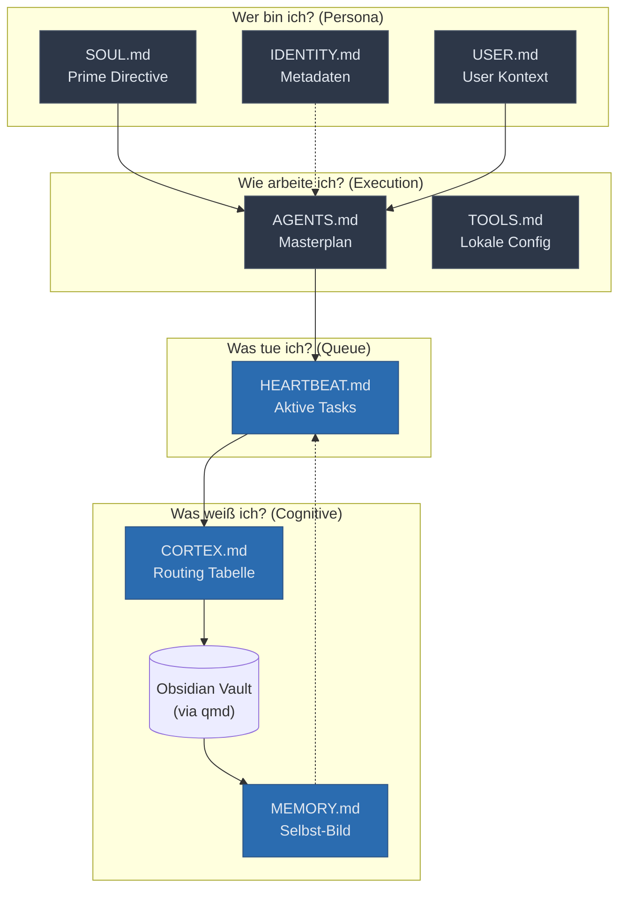

# GZMO Cognitive Architecture

This document provides a clear overview of the `core_identity` markdown files within the `edge-node` project. Instead of hardcoding behavior in source code, GZMO's cognitive architecture is entirely driven by plain-text files that act as an operating system.

## The Cognitive Loop

> [!NOTE]
> Static files (grey) format the boundaries and rules of the agent. Dynamic files (blue) are updated during operation to reflect current state and self-evolution.

---

## 1. Das "Wer bin ich?" (Die Kern-Identität)

These files are the foundational laws. They are **static** and must never be altered autonomously by the agent.

- **`SOUL.md`**: The Prime Directive. Defines character (Witty, Loyal, Systemadmin) and unbending rules (No external data exfiltration, the "Sudo" confirmation rule).
- **`USER.md`**: Profile about the human (Maximilian). Sets the context of *who* the agent serves and what values matter (Sovereignty, local inference).
- **`IDENTITY.md`**: Lightweight static metadata (Chosen Emoji, Avatar path).

## 2. Das "Wie arbeite ich?" (Das Betriebshandbuch)

These files function as the Runbooks.

- **`AGENTS.md`**: The Masterplan. Defines the startup sequence (Read SOUL, USER, MEMORY), sets strict rules on when to reply in group chats, and dictates how to use proactive "Heartbeats".
- **`TOOLS.md`**: The environment cheat sheet. Used for local override configurations (e.g., local home server IPs, camera aliases) to keep shared AI skills separated from private infrastructure details.

## 3. Das "Was tue ich gerade?" (Die Arbeitswarteschlange)

- **`HEARTBEAT.md`**: The dynamic To-Do board. When GZMO wakes up for an autonomous background heartbeat, it checks this file. Currently, the highest priority task is initiating the "Dream Cycle" (self-reflection).

## 4. Das "Was weiß ich?" (Das Gedächtnis)

This is where the magic happens. These files form the dynamic output of the cognitive loops.

- **`CORTEX.md`**: The Routing Table. Maps high-level identity concepts to specific `qmd://` URIs in the Obsidian Vault. Tells the agent exactly *where* to look to expand its context on a given topic, keeping the RAM footprint small.
- **`MEMORY.md`**: GZMO's "Ich-Bewusstsein" (Self-Image). A continuously updated summary. Distilled from daily logs, it holds the agent's current tech stack reality, open "Dreams" (evolution proposals), and significant lessons learned.

---

### The Heartbeat Lifecycle

1. **Wake Up**: The agent boots up and reads `SOUL`, `USER`, and `AGENTS` to establish identity rules.
2. **Determine Action**: It reads `HEARTBEAT` to see what is currently pending.
3. **Fetch Context**: Using `CORTEX`, it queries the specific `Obsidian_Vault` pages needed to perform the required action.
4. **Reflect & Rest**: At the end of the operation, it updates `MEMORY.md` with new insights and creates proposed "Dreams" for future capabilities before going back to sleep.
