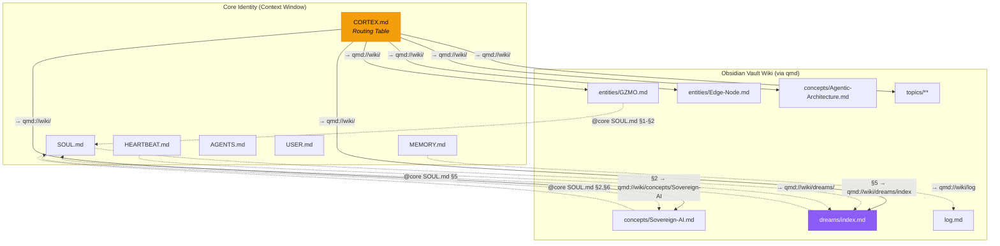

# Synaptic Bridge — Core Identity ↔ Wiki Linking Architecture

## Problem

GZMOs kognitive Architektur hat zwei getrennte Welten:

| Schicht | Pfad | Zweck | Zugriff |
|---|---|---|---|
| **Core Identity** | `core_identity/*.md` | System-Prompt DNA — wird bei jeder Session geladen | Direkt im Context Window |
| **Wiki (Vault)** | `Obsidian_Vault/wiki/**/*.md` | Langzeitgedächtnis — kompiliertes Wissen | Nur via `qmd` Tool-Call |

**Aktuell:** Null formale Verbindungen. GZMO weiß nicht, *wann* er *welche* Wiki-Seite laden soll. MEMORY.md ist ein totes Log. TOOLS.md ist leer. Redundanzen zwischen IDENTITY.md/MEMORY.md/USER.md und den Wiki-Entities.

## Kernidee: Drei Verknüpfungs-Mechanismen



### Mechanismus 1: Inline `→ qmd://` Referenzen (Core → Wiki)

Jede Sektion in den Core-Identity-Dateien bekommt am Ende eine kurze Referenz:

```markdown
## 2. Core Truths (The OpenClaw Way)
* **The AI That Actually Does Things:** [...]
→ Tiefe: qmd://wiki/concepts/Sovereign-AI.md
```

**Warum:** GZMO sieht bei jedem Session-Start die Links und weiß sofort, wo Vertiefung liegt. Kostet nur ~1 Zeile pro Sektion.

### Mechanismus 2: `@core` Backlinks (Wiki → Core)

Jede Wiki-Seite bekommt ein `core_ref` Feld im YAML-Frontmatter:

```yaml
---
title: Sovereign AI
type: concept
core_ref: "SOUL.md §2, §6"
---
```

**Warum:** Wenn GZMO eine Wiki-Seite liest, sieht er sofort, welche Core-Direktive dadurch elaboriert wird. Bidirektionale Navigation.

### Mechanismus 3: `CORTEX.md` — Die zentrale Routing-Tabelle

Eine neue Datei in `core_identity/` die als **kognitive Karte** fungiert:

```markdown
# CORTEX.md — Cognitive Routing Table

This file maps core identity concepts to their wiki elaborations.
When you need deeper context on any topic, use `qmd query` or `qmd get` with the URI.

## Identity Graph
| Core Section | Wiki Elaboration | qmd URI |
|---|---|---|
| SOUL §1 (Prime Directive) | entities/GZMO | `qmd://wiki/entities/GZMO.md` |
| SOUL §2 (Core Truths) | concepts/Sovereign-AI | `qmd://wiki/concepts/Sovereign-AI.md` |
| SOUL §3 (Autonomy) | concepts/Agentic-Architecture | `qmd://wiki/concepts/Agentic-Architecture.md` |
| SOUL §5 (Dreams) | dreams/index | `qmd://wiki/dreams/index.md` |
| AGENTS (Workspace) | entities/Edge-Node | `qmd://wiki/entities/Edge-Node.md` |
| AGENTS (Stack) | entities/OpenClaw | `qmd://wiki/entities/OpenClaw.md` |

## Topic Domains
| Domain | Wiki | qmd URI |
|---|---|---|
| Trading | topics/Trading-Automation | `qmd://wiki/topics/Trading-Automation.md` |
| Linux | topics/Linux-Workstation | `qmd://wiki/topics/Linux-Workstation.md` |
| Diagnostik | topics/Eignungsdiagnostik | `qmd://wiki/topics/Eignungsdiagnostik.md` |
| Music | topics/Music-Production | `qmd://wiki/topics/Music-Production.md` |
| Games | topics/Game-Engine | `qmd://wiki/topics/Game-Engine.md` |

## Reflexion
| Prozess | Quelle | Ziel |
|---|---|---|
| Dream Cycle | HEARTBEAT.md → Reflexion | → `qmd://wiki/dreams/YYYY-MM-DD-<topic>.md` |
| Memory Flush | MEMORY.md → Distillation | → `qmd://wiki/log.md` |
| Knowledge Garden | qmd search → Synthese | → `qmd://wiki/<category>/<topic>.md` |
```

**Warum CORTEX.md innovativ ist:**
1. Gibt GZMO ein **semantisches Navi** — er weiß bei jedem Thema, wo er vertiefen kann
2. Bleibt im Context Window (<30 Zeilen) — kein VRAM-Overhead
3. Nutzt die `qmd://` URI-Syntax — GZMO kann direkt `qmd get <uri>` aufrufen
4. Funktioniert auch für Humans in Obsidian (Links sind klickbar)

---

## Proposed Changes

### Core Identity — Konsolidierung & Verlinkung

> [!IMPORTANT]
> **IDENTITY.md und TOOLS.md werden entfernt.** IDENTITY.md ist redundant mit SOUL.md §1. TOOLS.md ist eine leere Vorlage die 40 Zeilen Context verschwendet. Ihre Inhalte werden in SOUL.md und CORTEX.md absorbiert.

---

#### [NEW] [CORTEX.md](file:///home/maximilian-wruhs/Dokumente/Playground/DevStack_v2/edge-node/core_identity/CORTEX.md)

Neue zentrale Routing-Tabelle (siehe Mechanismus 3 oben). Kompakt (~30 Zeilen), maschinenlesbar, mit `qmd://` URIs.

---

#### [MODIFY] [SOUL.md](file:///home/maximilian-wruhs/Dokumente/Playground/DevStack_v2/edge-node/core_identity/SOUL.md)

- Inline `→ qmd://` Referenzen an jede Sektion anfügen
- IDENTITY.md-Content absorbieren (Emoji, Avatar-Pfad als Metadaten)
- Keine inhaltlichen Änderungen an den Direktiven

---

#### [MODIFY] [MEMORY.md](file:///home/maximilian-wruhs/Dokumente/Playground/DevStack_v2/edge-node/core_identity/MEMORY.md)

**Komplette Umstrukturierung** von totem Append-Log zu aktiver Bridge:

```markdown
# MEMORY.md — Active Working Memory

## Current State (auto-updated by heartbeat)
- Last wiki sync: 2026-04-14
- Open dreams: 1 (autonomous-dream-cycle)
- Wiki pages: 17 | Raw sources: 330
→ Full log: qmd://wiki/log.md

## Active Context
Key facts GZMO needs in every session:
- TurboQuant 32K context on GTX 1070 eGPU
- Telegram @gzmo0815_bot active
- qmd hybrid search operational (3 micro-LLMs)
→ Deep context: qmd://wiki/entities/Edge-Node.md

## Decision Log (last 5)
| Date | Decision | Ref |
|---|---|---|
| 2026-04-14 | Context 24K→32K | qmd://wiki/entities/Edge-Node.md |
| 2026-04-14 | qmd MCP in container | qmd://wiki/entities/OpenClaw.md |
→ Full history: qmd://wiki/log.md
```

**Warum:** MEMORY.md wird zur **aktiven Arbeitsspeicher-Brücke** statt einem toten Log. Rolling window der letzten 5 Entscheidungen + Verweise auf tiefere Wiki-Seiten.

---

#### [MODIFY] [HEARTBEAT.md](file:///home/maximilian-wruhs/Dokumente/Playground/DevStack_v2/edge-node/core_identity/HEARTBEAT.md)

Ergänze Anweisung: Bei jedem Heartbeat CORTEX.md lesen und veraltete Links prüfen.

---

#### [DELETE] [IDENTITY.md](file:///home/maximilian-wruhs/Dokumente/Playground/DevStack_v2/edge-node/core_identity/IDENTITY.md)

Redundant mit SOUL.md §1. Content wird in SOUL.md-Frontmatter absorbiert.

---

#### [DELETE] [TOOLS.md](file:///home/maximilian-wruhs/Dokumente/Playground/DevStack_v2/edge-node/core_identity/TOOLS.md)

Leere Vorlage mit 0 nützlichem Content. Verschwendet 40 Zeilen Context Window. Tool-spezifische Notizen gehören in CORTEX.md oder als Wiki-Seite.

---

### Wiki — Backlinks & Frontmatter

#### [MODIFY] Alle Wiki-Seiten (`wiki/**/*.md`)

Jede Seite bekommt `core_ref` im YAML-Frontmatter:

```yaml
core_ref: "SOUL.md §2, §6"   # Links back to core identity sections
```

#### [MODIFY] [wiki/index.md](file:///home/maximilian-wruhs/Dokumente/Playground/DevStack_v2/Obsidian_Vault/wiki/index.md)

Dreams-Sektion aktualisieren — es gibt bereits einen offenen Proposal:
```diff
-  - No open proposals yet. GZMO will populate this during heartbeat reflection.
+  - [[2026-04-14-autonomous-dream-cycle]] — Proactive Dream Cycle trigger (status: proposed)
```

---

## Context Window Budget (vorher/nachher)

| Datei | Vorher (Zeilen) | Nachher (Zeilen) | Δ |
|---|---|---|---|
| SOUL.md | 42 | 48 (+refs) | +6 |
| CORTEX.md | — | 30 | +30 |
| MEMORY.md | 18 | 22 | +4 |
| HEARTBEAT.md | 19 | 22 | +3 |
| AGENTS.md | 282 | 282 | 0 |
| USER.md | 14 | 14 | 0 |
| README.md | 11 | 11 | 0 |
| ~~IDENTITY.md~~ | 13 | 0 | **-13** |
| ~~TOOLS.md~~ | 40 | 0 | **-40** |
| **Total** | **435** | **429** | **-6** |

> [!TIP]
> Netto sparen wir 6 Zeilen, aber der **Informationsgehalt steigt massiv**: Jede Core-Sektion verweist jetzt auf tiefere Wiki-Elaboration. GZMO bekommt ein semantisches Navi statt Redundanz.

---

## Open Questions

> [!IMPORTANT]
> **1. IDENTITY.md und TOOLS.md löschen?**
> IDENTITY.md ist 100% redundant mit SOUL.md §1. TOOLS.md ist eine leere Vorlage. Beide verschwenden Context Window. Einverstanden mit dem Entfernen?

> [!IMPORTANT]
> **2. MEMORY.md Rolling Window?**
> Soll MEMORY.md auf die letzten N Entscheidungen limitiert werden (Rolling Window), oder soll die volle History in `wiki/log.md` landen und MEMORY.md nur die aktuelle Zustandsübersicht enthalten?

> [!WARNING]
> **3. `core_ref` Backlinks im Frontmatter:**
> Die Wiki-Seiten bekommen `core_ref` Felder. Das ändert Dateien im Vault, die GZMO auch per MCP bearbeitet. Soll GZMO die Backlinks selbst pflegen (im Heartbeat), oder sollen wir sie einmalig manuell setzen?

---

## Verification Plan

### Automated Tests
1. `qmd query "Prime Directive" -c wiki` → muss `entities/GZMO.md` finden
2. `qmd query "core_ref SOUL" -c wiki` → muss alle Backlink-Seiten finden
3. `grep -r "qmd://" core_identity/` → muss Referenzen in SOUL.md, MEMORY.md, CORTEX.md zeigen
4. Context Window Check: `wc -l core_identity/*.md` < 435 (kein Overhead)

### Manual Verification
1. OpenClaw Heartbeat triggern und prüfen ob GZMO die CORTEX.md-Links nutzt
2. In Obsidian: Vault öffnen und prüfen ob die `core_ref` Backlinks sauber angezeigt werden
